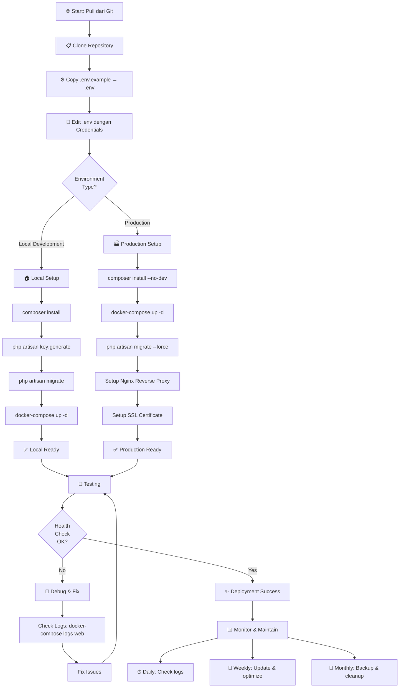
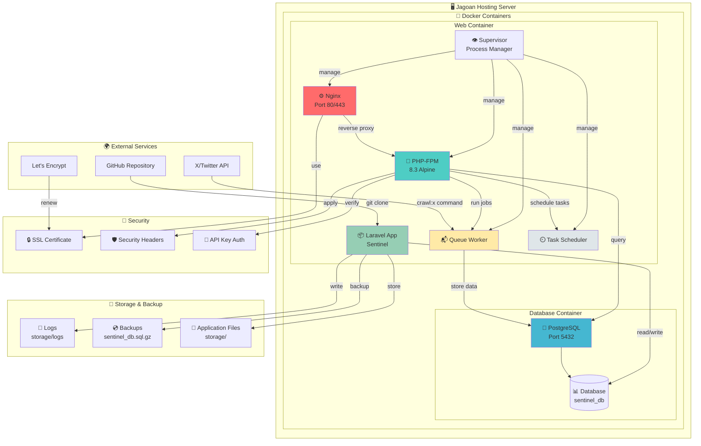
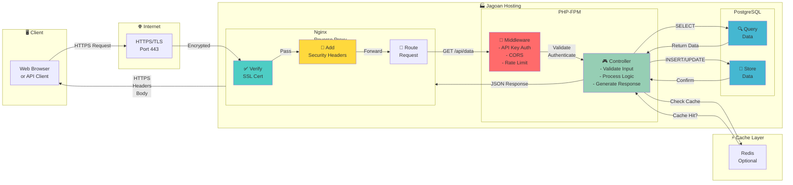
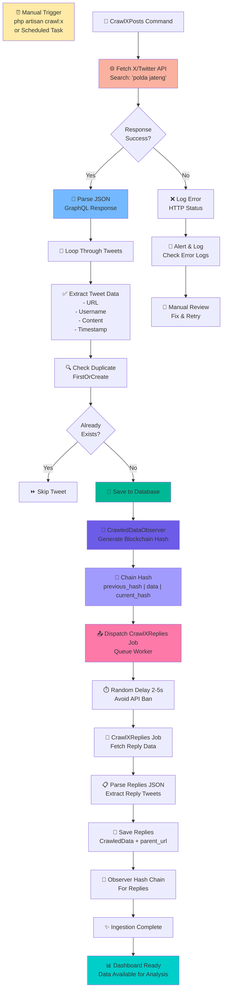
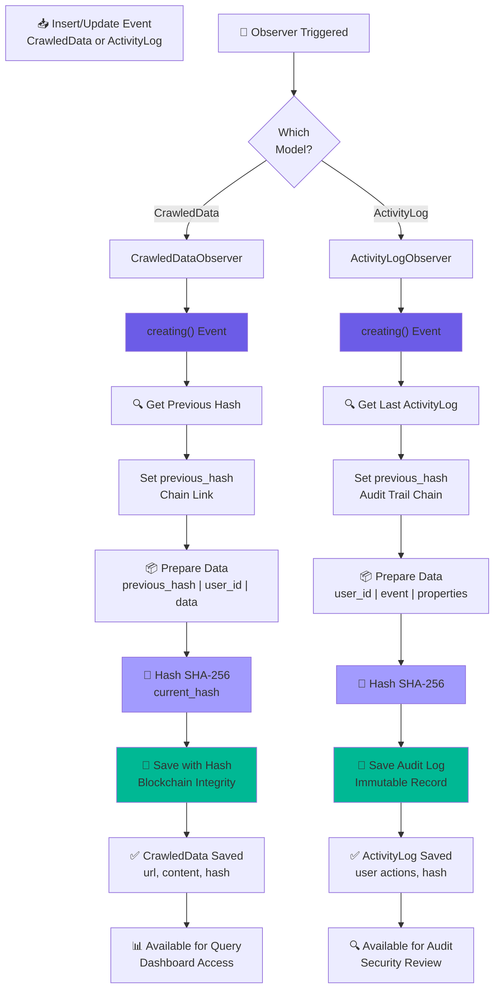
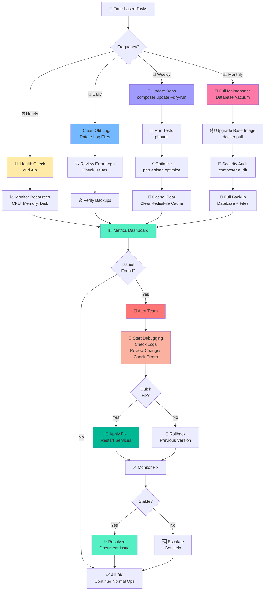
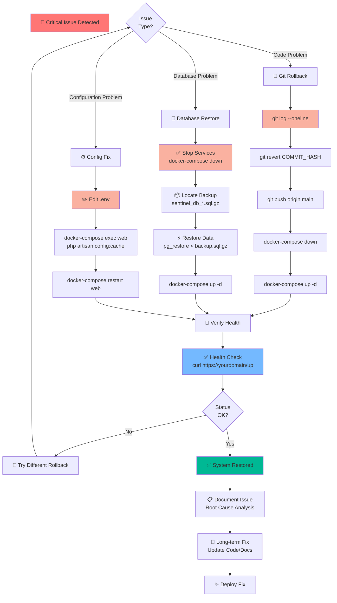
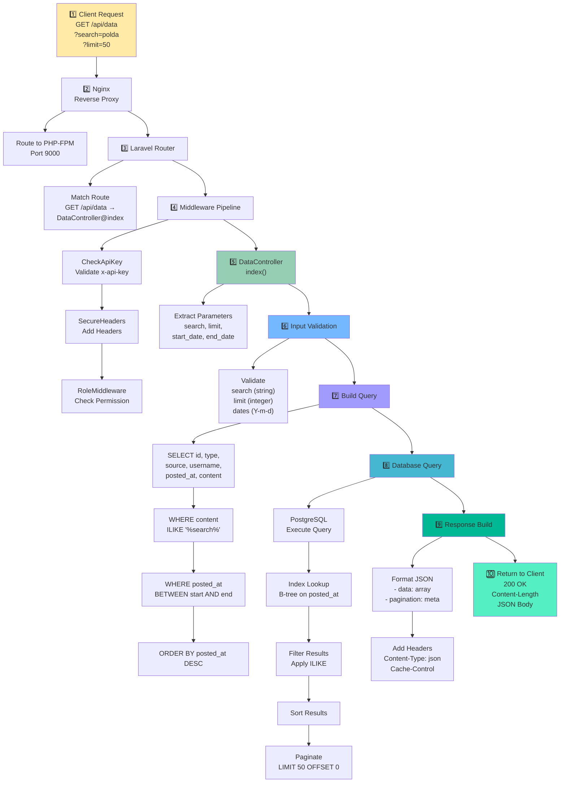

# 📊 FLOWCHART & ARCHITECTURE DIAGRAMS - Sentinel Backend

## 1. 🚀 DEPLOYMENT PROCESS FLOW

---

## 2. 🏗️ SYSTEM ARCHITECTURE DIAGRAM

---

## 3. 📡 REQUEST FLOW DIAGRAM

---

## 4. 🔄 CRAWLER & DATA INGESTION FLOW

---

## 5. 🗄️ DATABASE & OBSERVER PATTERN

---

## 6. 🔐 SECURITY & MIDDLEWARE FLOW

```mermaid
flowchart LR
    A["📩 Incoming Request"]

    A --> B["🔒 SSL/TLS Verify"]
    B --> C["✅ Certificate Valid?"]
    C -->|No| C1["❌ Reject"]
    C -->|Yes| D["📝 SecureHeaders<br/>Add Security Headers"]

    D --> E["🛡️ Headers Set<br/>X-Frame-Options: DENY<br/>X-Content-Type-Options: nosniff<br/>HSTS: max-age=31536000<br/>CSP Headers"]

    E --> F["🔐 CheckApiKey Middleware"]
    F --> G["🔑 Extract API Key<br/>from Header: x-api-key"]

    G --> H["🔍 Validate<br/>IP Whitelist?<br/>CIDR Match?"]
    H -->|IP Not Allowed| I["❌ 403 Forbidden"]

    H -->|IP OK| J["🔑 Compare Key<br/>hash_equals"]
    J -->|Wrong Key| K["❌ 401 Unauthorized"]
    J -->|Correct Key| L["✅ Authenticate"]

    L --> M["👤 RoleMiddleware<br/>Check User Role"]
    M --> N{"User Has<br/>Permission?"}
    N -->|No| O["❌ 403 Access Denied"]
    N -->|Yes| P["✅ Allow Request"]

    P --> Q["🎮 Controller<br/>Process Request"]

    Q --> R["✔️ Validate Input<br/>- Date Format: Y-m-d<br/>- URL Regex: x.com|twitter.com<br/>- Type: post|reply"]

    R --> S{"Valid<br/>Data?"}
    S -->|No| T["❌ 422 Unprocessable<br/>Show Error Messages"]
    S -->|Yes| U["💾 Save to Database<br/>Observer Auto-Hash"]

    U --> V["✅ 200/201 Response<br/>JSON Data"]

    C1 --> W["🔚 End: Reject"]
    I --> W
    K --> W
    O --> W
    T --> W
    V --> W

    style B fill:#ff6b6b
    style D fill:#fd79a8
    style F fill:#6c5ce7
    style M fill:#6c5ce7
    style R fill:#74b9ff
    style U fill:#00b894
    style V fill:#55efc4
```

---

## 7. 🧹 MAINTENANCE & MONITORING FLOW

---

## 8. 🔄 ROLLBACK & RECOVERY FLOW

---

## 9. 📊 DATA FLOW: API REQUEST TO DATABASE

---

## 🔑 LEGEND

| Emoji | Meaning             |
| ----- | ------------------- |
| 🚀    | Start/Launch        |
| ✅    | Success             |
| ❌    | Error/Failure       |
| 🔐    | Security            |
| 💾    | Database            |
| 🐳    | Docker              |
| ⏰    | Time/Scheduling     |
| 🔄    | Process/Loop        |
| 📊    | Monitoring          |
| 🧹    | Cleanup/Maintenance |
| 🐛    | Debug/Fix           |
